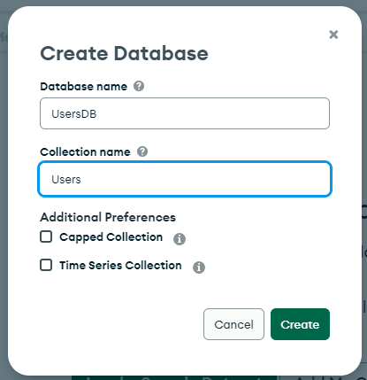
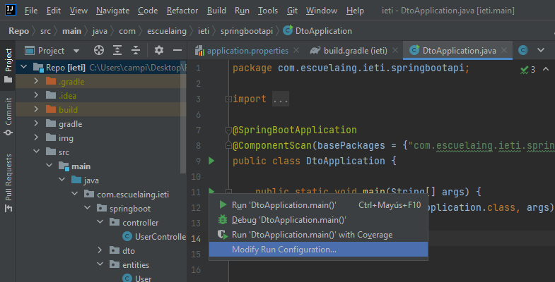

# Laboratorio 2: Spring Data con MongoDb

## Inovación y Emprendimiento con Tecnologías de Información

#### Camilo Andrés Pichimata Cárdenas

##### Septiembre del 2022

## Objetivos

- Explicar qué es MongoDB.

- Explicar la diferencia entre SQL y NoSQL.

- Crear un clúster de MongoDB en Atlas.

- Conectar su proyecto Spring Boot con un cluster MongoDB.

## Temas Principales

- NoSQL.

- MongoDB.

- Cluster.

## Desarrollo

### Parte 1: Creación de la cuenta en Atlas y primer clúster:

Se realizó el registro con la cuenta de GitHub, para esto se configuró el correo vinculado a GitHub como público, luego se aceptaron los términos de servicio y política de privacidad de la aplicación. 


Seguido a esto damos click en el botón `Build a Database`


Seleccionamos la opción gratuita.


En este caso dejaremos las configuraciones de proveedor de nube, región y nivel del cluster seleccionadas por defecto


Asignamos un nombre al nuevo cluster y damos click en el botón `Create Cluster`


Seleccionamos como nos gustaría validar la conexión al cluster, en este caso seleccionamos Usuario y Contraseña, seguido a esto ingresamos las credenciales y creamos un usuario dando click en el botón `Create User`


Agregamos las direcciones IP desde las que nos conectaremos al cluster, nos desplazamos hacia abajo y damos click en el botón `Finish and Close`.


### Parte 2: Conexión del clúster MongoDB con Spring Boot

Para conectar el cluster creado anteriormente damos click en el botón `Connect`

 

Seleccionamos la segunda opción, `Connect your application`

 

En los menús desplegables, seleccionamos el driver para Java y la última versión disponible, luego damos click en el botón `Close`

 

Seguido a esto agregamos una variable de entorno al archivo ***application.properties*** con el fin de almacenar el URI de MongoDB agregando la siguiente línea: 

```conf
spring.data.mongodb.uri=${MONGODB_URI}
```

Antes de agregar la variable de entorno a las configuraciones de ejecución debemos crear nuestra base de datos, para esto regresamos de nuevo a la pantalla principal en la interfaz de usuario de MongoDB y damos click en la opción `Browse Collections`

 

Damos click en la opción `Add My Own Data` para crear la primera base de datos de nustro cluster

 

Rellenamos los campos con los nombres que deseamos para nuestra primera base de datos y colección y damos click en el botón `Create`



Al crearse la base de datos podemos visualizarla desde la opción `Browse Collections` desde la pestaña `Collections` como se ve a continuación


Tesrminado esto ingresamos a IntelliJ Idea, damos click derecho sobre el icono que permite la ejecución de la aplicación desde la clase principal o el método main del proyecto y seleccionamos la opción `Modify Run Configuration...` con el fin de agregar la variable de entorno a las configuraciones de ejecución

 

Si damos click en el emoticón del campo de texto *Environment variables* se abre una nueva ventana (A la derecha) en la que podemos definir el link de conexión generado al escoger el driver y versión para Java, en este debemos reemplazar ***\<password\>*** por la contrasena especificada al crear el usuario ***camilopichimata*** y se debe especificar el nombre de la base de datos creada anteriormente, en nuestro caso ***UsersDB***

 

Para terminar agregamos la dependencia *Spring Boot starter data MongoDB* al archivo ***build.gradle*** y ejecutamos la aplicación para verificar que la conexión se realizó satisfactoriamente 

```conf
dependencies {
    implementation 'org.springframework.boot:spring-boot-starter-data-mongodb'
}
```

Con el fin de evadir futuros problemas en la conexión a la base de datos, vamos a permitir que se pueda conectar al cluster desde cualquier dirección IP para esto estando en la pantalla principal de la interfaz de MongoDB en la parte izquierda seleccionamos la opción `Network Access`

 

Damos click en el botón `+ADD IP ADDRESS`, en la ventana que aparece damos click en el botón `ALLOW ACCESS FROM ANYWHERE`, al hacer esto, se debe ver **0.0.0.0/0** en la lista de accesos.

 

Finalmente damos click en el botón `Confirm` para guardar la configuración realizada y podremos ver que esta entrada aparece en el listado junto con la anteriormente especificada.

 

### Parte 3: Implementación del servicio MongoDB


