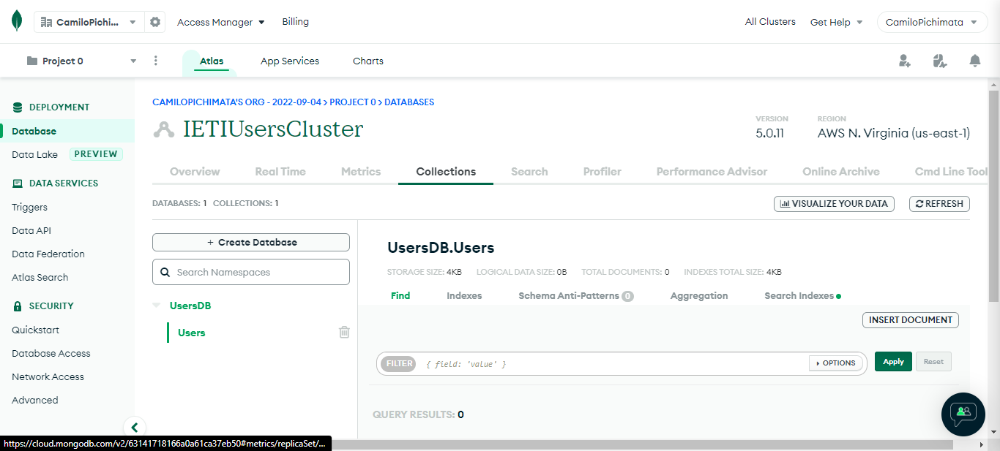
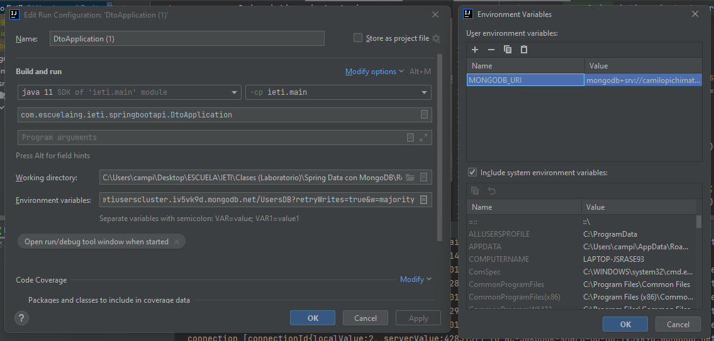
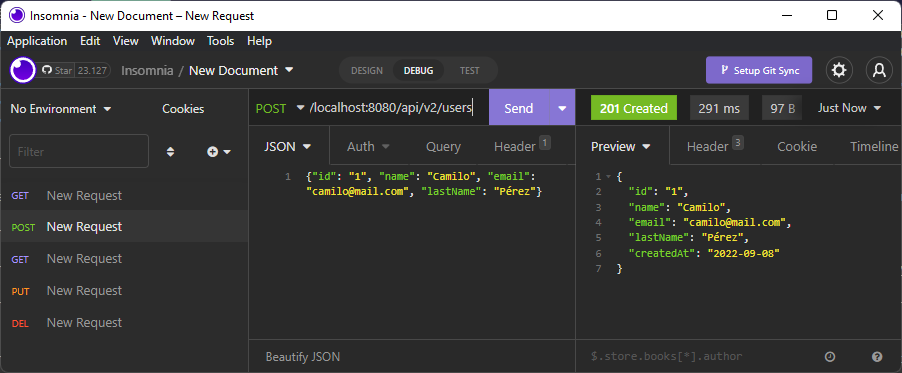
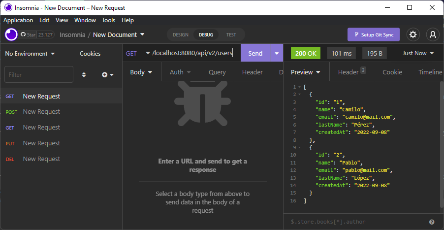
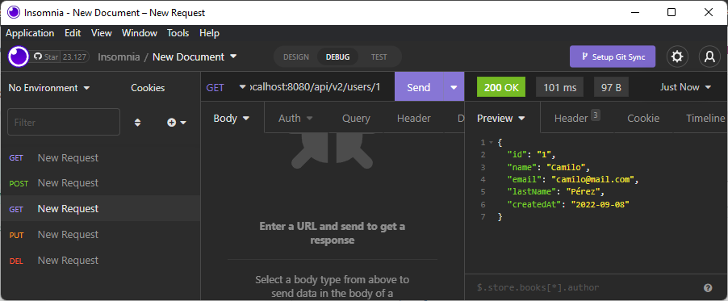

# Laboratorio 2: Spring Data con MongoDb

## Inovación y Emprendimiento con Tecnologías de Información

#### Camilo Andrés Pichimata Cárdenas

##### Septiembre del 2022

## Objetivos

- Explicar qué es MongoDB.

- Explicar la diferencia entre SQL y NoSQL.

- Crear un clúster de MongoDB en Atlas.

- Conectar su proyecto Spring Boot con un cluster MongoDB.

## Temas Principales

- NoSQL.

- MongoDB.

- Cluster.

## Desarrollo

### Parte 1: Creación de la cuenta en Atlas y primer clúster:

Se realizó el registro con la cuenta de GitHub, para esto se configuró el correo vinculado a GitHub como público, luego se aceptaron los términos de servicio y política de privacidad de la aplicación. 


Seguido a esto damos clic en el botón `Build a Database`


Seleccionamos la opción gratuita.


En este caso dejaremos las configuraciones de proveedor de nube, región y nivel del cluster seleccionadas por defecto


Asignamos un nombre al nuevo cluster y damos clic en el botón `Create Cluster`


Seleccionamos como nos gustaría validar la conexión al cluster, en este caso seleccionamos Usuario y Contraseña, seguido a esto ingresamos las credenciales y creamos un usuario dando clic en el botón `Create User`


Agregamos las direcciones IP desde las que nos conectaremos al cluster, nos desplazamos hacia abajo y damos clic en el botón `Finish and Close`.


### Parte 2: Conexión del clúster MongoDB con Spring Boot

Para conectar el cluster creado anteriormente damos clic en el botón `Connect`

 

Seleccionamos la segunda opción, `Connect your application`

 

En los menús desplegables, seleccionamos el driver para Java y la última versión disponible, luego damos clic en el botón `Close`

 

Seguido a esto agregamos una variable de entorno al archivo ***application.properties*** con el fin de almacenar el URI de MongoDB agregando la siguiente línea: 

```conf
spring.data.mongodb.uri=${MONGODB_URI}
```

Antes de agregar la variable de entorno a las configuraciones de ejecución debemos crear nuestra base de datos, para esto regresamos de nuevo a la pantalla principal en la interfaz de usuario de MongoDB y damos clic en la opción `Browse Collections`

 

Damos clic en la opción `Add My Own Data` para crear la primera base de datos de nustro cluster

 

Rellenamos los campos con los nombres que deseamos para nuestra primera base de datos y colección y damos clic en el botón `Create`


Al crearse la base de datos podemos visualizarla desde la opción `Browse Collections` desde la pestaña `Collections` como se ve a continuación



Tesrminado esto ingresamos a IntelliJ Idea, damos clic derecho sobre el icono que permite la ejecución de la aplicación desde la clase principal o el método main del proyecto y seleccionamos la opción `Modify Run Configuration...` con el fin de agregar la variable de entorno a las configuraciones de ejecución

 

Si damos clic en el emoticón del campo de texto *Environment variables* se abre una nueva ventana (A la derecha) en la que podemos definir el link de conexión generado al escoger el driver y versión para Java, en este debemos reemplazar ***\<password\>*** por la contrasena especificada al crear el usuario ***camilopichimata*** y se debe especificar el nombre de la base de datos creada anteriormente, en nuestro caso ***UsersDB***

 

Para terminar agregamos la dependencia *Spring Boot starter data MongoDB* al archivo ***build.gradle*** y ejecutamos la aplicación para verificar que la conexión se realizó satisfactoriamente 

```conf
dependencies {
    implementation 'org.springframework.boot:spring-boot-starter-data-mongodb'
}
```

Con el fin de evadir futuros problemas en la conexión a la base de datos, vamos a permitir que se pueda conectar al cluster desde cualquier dirección IP para esto estando en la pantalla principal de la interfaz de MongoDB en la parte izquierda seleccionamos la opción `Network Access`

 

Damos clic en el botón `+ADD IP ADDRESS`, en la ventana que aparece damos clic en el botón `ALLOW ACCESS FROM ANYWHERE`, al hacer esto, se debe ver **0.0.0.0/0** en la lista de accesos.

 

Finalmente damos clic en el botón `Confirm` para guardar la configuración realizada y podremos ver que esta entrada aparece en el listado junto con la anteriormente especificada.

 

### Parte 3: Implementación del servicio MongoDB

Después de seguir las instrucciones y de realizar las implementaciones necesarias se realizaron las siguientes pruebas:

#### - Create

Se le pide al servicio crear un usuario mediante el envío de una petición `POST` a `http://localhost:8080` con las siguientes características:

```json
{"id": "1", "name": "Camilo", "email": "camilo@gmail.com", "lastName": "Pérez"}
```

 

Como se puede ver la respuesta fue satisfactoria al responder con el código de respuesta **201 (Created)** y visualizarse en el cuerpo de la respuesta el usuario creado, seguido a esto se realiza una nueva petición para guardar un nuevo usuario con los siguientes datos:

```json
{"id": "1", "name": "Pablo", "email": "pablo@mail.com", "lastName": "López"}
```

 

Como se puede ver se responde con un código de error **409 (Conflict)**, esto se debe a que el ***id*** especificado para este usuario se ya se encuentra registrado para otro usuario, si cambiamos el ***id*** a ***id=2*** el registro se realiza correctamente como se puede ver a continuación:

 

En este caso el código de respuesta ya es satisfactorio.

#### - Get All

Se realiza una petición `GET` a la dirección `http://localhost:8080` con el fin de obtener los usuarios registrados en el sistema hasta el momento.



En este caso se muestra una lista con los dod usuarios creados anteriormente. 
Si verificamos desde la aplicación web de Mongo podemos ver los dos usuarios registrados.


#### - Find By Id

Se realiza nuevamente una petición `GET` a la dirección `http://localhost:8080/1`, pero como se puede ver, indicando en el path de la dirección el ***id*** del usuario a consultar, en este caso vamos a consultar el primer usuario registrado anteriormente



#### - Update

Se realiza una petición `POST` nuevamente indicando en la dirección el ***id*** del usuario a modificar, en este caso modificaremos los datos del segundo usuario registrado enviando la siguiente información:

```json
{"id": "2", "name": "Juan Pablo", "email": "pablolopez@mail.com", "lastName": "López Niño"}
```


Como se puede ver en la respuesta del mensaje, los cambios se realizaron correctamente

#### - Delete

Finalmente enviamos una petición `DEL` a `http://localhost:8080/1`, como se puede ver, indicando el ***id*** del primer usuario registrado con el fin de eliminar su registro:


Como se puede ver el código de la respuesta es satisfactorio **200 (OK)** y en el cuerpo del mensaje **true** lo que nos indica que la eliminación del registro se realizó correctamente; Si realizamos nuevamente una petición de todos los usuarios podemos ver en la lista de usuarios que solo se encuentra el segundo usuario registrado:


